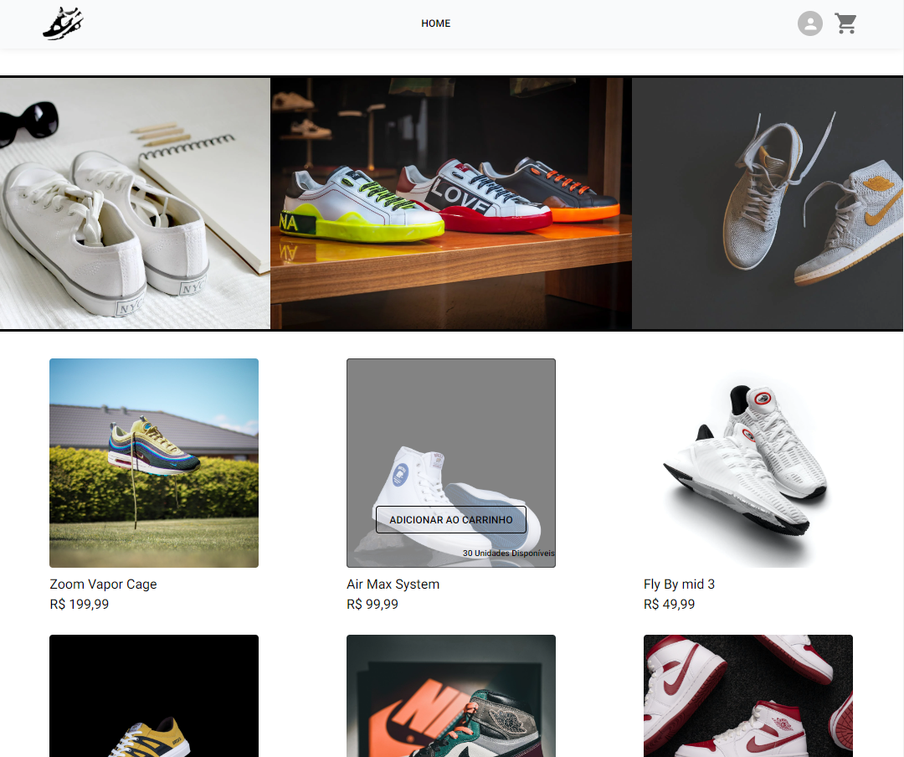
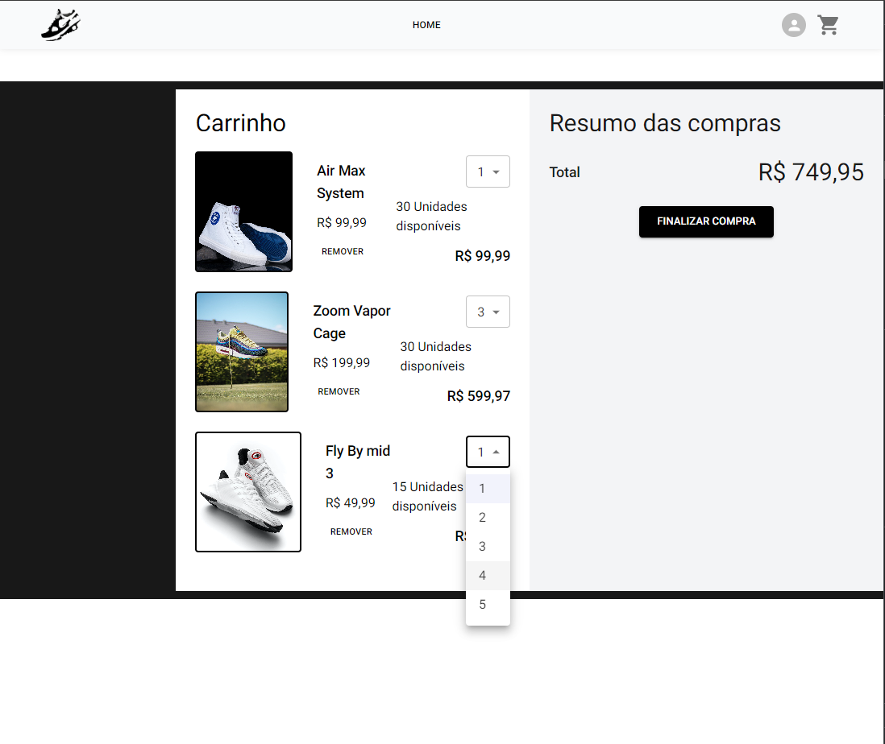
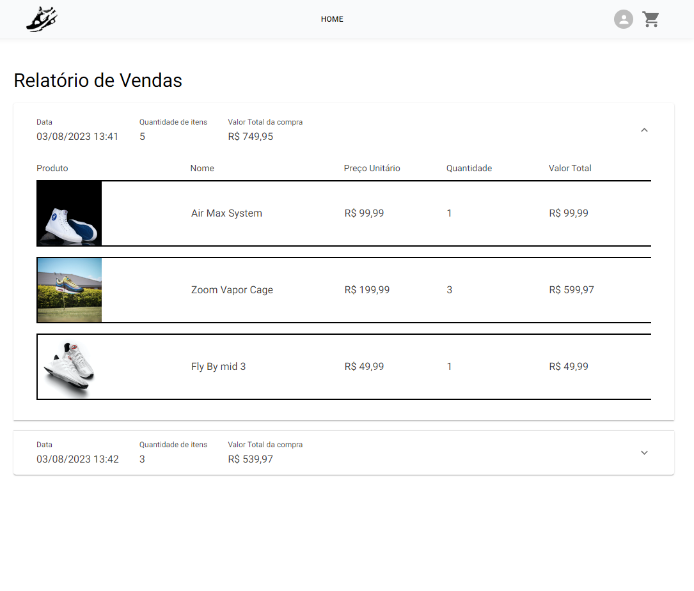
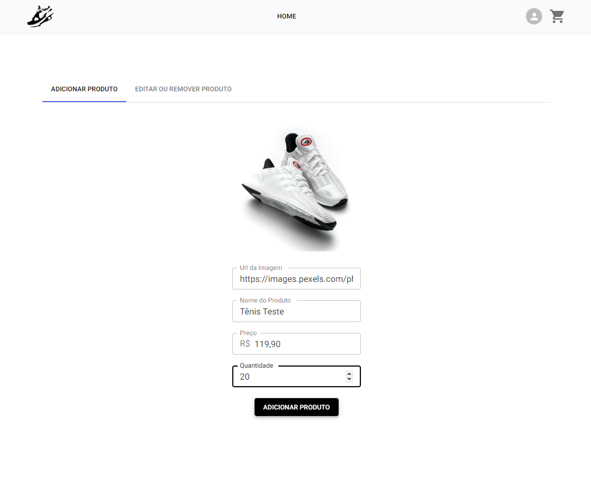
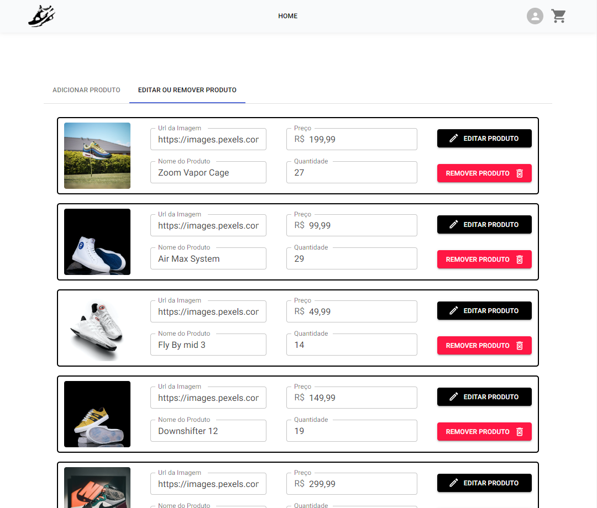
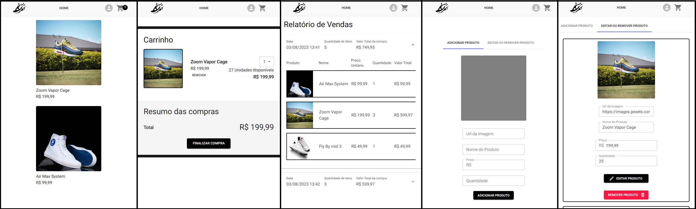
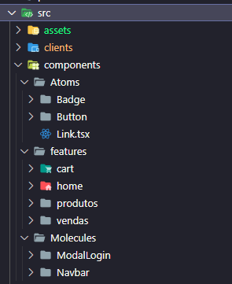
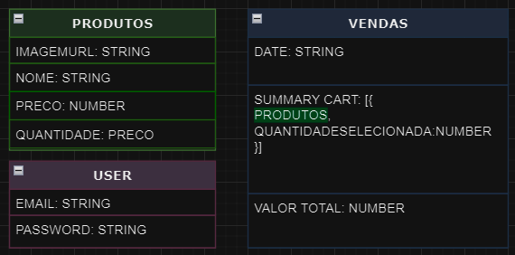

<h1 align="center">
    Loja Virtual - E-Shoes
</h1>

<p align="center">
 <a href="#-sobre-o-projeto">Sobre</a> •
 <a href="#-funcionalidades">Funcionalidades</a> •
 <a href="#-layout">Layout</a> • 
 <a href="#-como-executar-o-projeto">Como executar</a> • 
 <a href="#-tecnologias">Tecnologias</a>
</p>

## 💻 Sobre o projeto

A loja virtual E-Shoes faz parte do processo seletivo para Desenvolvedor Front-End na etapa de teste técnico.
Proposta do projeto: Desenvolva um painel administrativo para uma loja virtual. O painel deve permitir que o administrador visualize informações sobre os produtos, gerencie o inventário e veja as vendas.
Projeto composto apenas por Frontend, utilizando o LocalStorage para simular um banco de dados.

---

## ⚙️ Funcionalidades

- [x] Modal de Login: Usuários podem logar na plataforma utilizando email e senha hardcoded, (para logar na aplicação os usuários devem utilizar as credenciais abaixo.):

  - [x] Email: admin@teste.com
  - [x] Password: teste
  ###### Obs: Qualquer outra crendecial, ira acarretar em problema de login

- [x] Visualização de Produtos: Página home implementada mostrando todos os produtos disponíveis na loja, cada produto tem as seguintes especificações:

  - [x] Imagem

  - [x] Nome

  - [x] Preço

  - [x] Quantidade no estoque

- [x] Gerenciamento de Inventário, o usuário de perfil administrador pode fazer as seguintes modificações.
  - [x] Adicionar Produtos

  - [x] Editar Produtos - aspectos:
    - [x] Imagem
    - [x] Nome
    - [x] Preço
    - [x] Quantidade no estoque

  - [x] Remover Produtos
###### Obs: Apenas usuário logado como administrador.


- [x] Visualização de Vendas: Implementação de uma página que mostre todas as vendas realizadas, para cada venda deve-se mostrar os seguintes aspectos. 
    - [x] Produtos
    - [x] Quantidades
    - [x] Preços unitários
    - [x] Preço total
    - [x] Data da venda
###### Obs: Apenas usuário logado como administrador.

## 🎨 Layout

O layout da aplicação:

<p align="center" style="display: flex; align-items: flex-start; justify-content: center;">

## Home - Produtos

  

## Carrinho de Compras

  

## Resumo de vendas

  

## Adicionar Produto

  

## Editar ou Remover Produto

  

## Projeto em escala Mobile 📱

  
</p>

### Estruturação de pastas 📂 e Design System 🖌️

Para a padronização, melhores práticas e a legibilidade do código, foi introduzido a utilização do Atomic Design, fazendo reaproveitamento dos componentes utilizados ao longo da aplicação.




---
##### ✔️ Todas as imagens utilizadas nos produtos são da plataforma [Pexels](https://www.pexels.com/pt-br/), e podem ser utilizadas publicamente para fins educativos.
---

## 🚀 Como executar o projeto
### Pré-requisitos

Antes de começar, você vai precisar ter instalado em sua máquina as seguintes ferramentas:
[Git](https://git-scm.com), [Node.js](https://nodejs.org/en/).

Além de um editor de código como o [VSCode](https://code.visualstudio.com/).

#### 🎲 Rodando a Aplicação Web (Frontend)

```bash
# Clone este repositório
$ https://github.com/RenatoAlbuquerque/loja-virtual-byf12.git
# Acesse a pasta do projeto no terminal/cmd
$ cd loja-virtual-byf12
# Instale as dependências
$ npm install
# Execute a aplicação
$ npm run dev
# A aplicação iniciará na porta:3000 - acesse http://localhost:3000
```

---

## 🛠 Tecnologias

As seguintes ferramentas foram usadas na construção do projeto:

#### **Simulação do Banco de dados no LocalStorage**

  

#### **Principais bibliotecas utilizadas** ([Next](https://nextjs.org/))

- **[Moment](https://momentjs.com/)**
- **[React-Responsive-Carousel](https://www.npmjs.com/package/react-responsive-carousel)**
- **[React-toastify](https://fkhadra.github.io/react-toastify/introduction)**
- **[Typescript](https://www.typescriptlang.org/)**

> Veja o arquivo [package.json](https://github.com/RenatoAlbuquerque/loja-virtual-byf12/blob/main/package.json)

